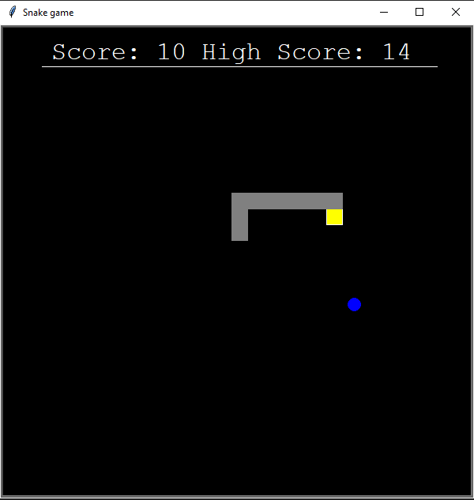

# Games
Developing games is one of the best ways to learn to program. So I have to build a lot of simple to intermediate games. Some of them have GUI and others just work on the terminal. Overall these projects were fun and really enjoyed them. So far I only used java and python for it.
### Languages & tools :
[][java]
[][python]
[][python]
[][java]
  

|Java Pong| Python Pong Menu |Python Pong Game|Python Snake Game|
|------|-------|-------|------|
|[][java pong]|[][python pong]|[][python pong]|[][python snake game]|
|Java BlockCrush|gameover|Python Connect4|Python Connect4|
|[][java block crush]|[][java block crush]|[][python connect4]|[][python connect4]|
|Python Tic Tac Toe|Python Tic Tac Toe|
[][python tic tac toe]|[][python tic tac toe]|

### Directory Structure :
    |-- Java
    |    |-- blokcBreaker
    |    |-- blokcBreaker-java
    |    |-- blokcBreaker v2.0
    |    |-- HideAndSeek
    |    |-- Pong(minimal)-java
    |    |-- TowerOfHanoi-Gui
    |    |-- TowerOfHanoi-Terminal
    |
    |-- Python
    |    |-- Checkers-python
    |    |-- Connect four-python
    |    |-- pong-python
    |    |-- Snake-python
    |    |-- Tetris-python
    |    |-- Tic tac toe
    |
    |-- Img

### Connect with me :  

  
 

[python tic tac toe]: https://github.com/AbhilashTUofficial/TicTacToe-PythonGame
[python connect4]: https://github.com/AbhilashTUofficial/Connect4-PythonGame
[python snake game]:https://github.com/AbhilashTUofficial/Snake-PythonGame
[java block crush]: https://github.com/AbhilashTUofficial/BlockCrush-JavaGame
[python pong]: https://github.com/AbhilashTUofficial/Pong-PythonGame
[java pong]: https://github.com/AbhilashTUofficial/Pong-JavaGame
[github]: https://github.com/AbhilashTUofficial
[python]: https://github.com/AbhilashTUofficial/Python-programming
[java]: https://github.com/AbhilashTUofficial/java-programming

